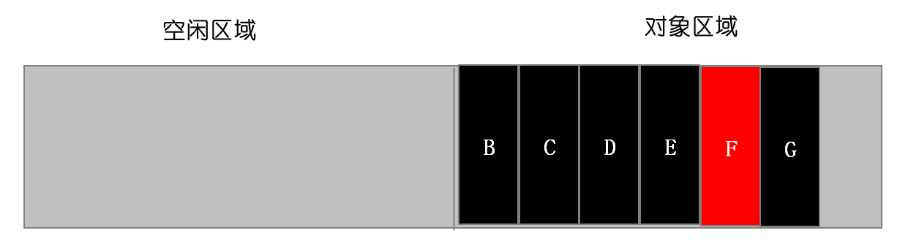
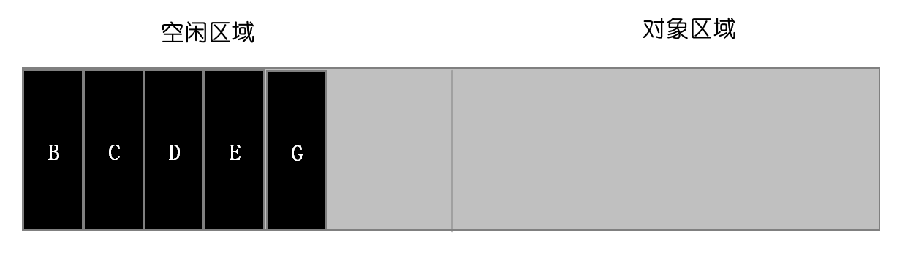

# 垃圾回收机制

## 1. 垃圾回收的方式

**手动垃圾回收**和**自动垃圾回收**

c语言是手动垃圾回收

javaScript是自动垃圾回收

## 2. javaScript垃圾回收的方式

* 调用栈中的垃圾数据回收方式
* 堆中垃圾数据的回收方式

## 3. 调用栈中的垃圾数据回收方式

**当一个函数执行结束之后，JavaScript 引擎会通过向下移动 ESP 来销毁该函数保存在栈中的执行上下文**

```javascript
function foo(){ 
	var a = 1;
	var b = {name:"王美丽"};
    function showName(){ 
    	var c = 2;
        var d = {name:"闷倒驴"};
    };
    showName()
};
foo()
```


## 4. 堆中的垃圾回收方式


当函数直接结束，栈空间处理完成了，但是堆空间的数据虽然没有被引用，但是还是存储在堆空间中，需要垃圾回收器将堆空间中的垃圾数据回收

### 4.1 代际假说

代际假说有以下两个特点：

* 第一个是大部分对象在内存中存在的时间很短，简单来说，就是很多对象一经分配内存，很快就变得不可访问；

* 第二个是不死的对象，会活得更久。

### 4.2 分代收集


为了使垃圾回收达到更好的效果，根据对象的生命周期不一样，使用不同的垃圾回收的算法

**在 V8 中会把堆分为新生代和老生代两个区域，新生代中存放的是生存时间短的对象，老生代中存放的生存时间久的对象**

新生区通常只支持 1～8M 的容量，而老生区支持的容量就大很多了。对于这两块区域，V8 分别使用两个不同的垃圾回收器，以便更高效地实施垃圾回收。

副垃圾回收器，主要负责新生代的垃圾回收。

主垃圾回收器，主要负责老生代的垃圾回收。

### 4.3 垃圾回收器的工作流程

**第一步是标记**空间中活动对象和非活动对象。所谓活动对象就是还在使用的对象，非活动对象就是可以进行垃圾回收的对象。

**第二步是回收**非活动对象所占据的内存。其实就是在所有的标记完成之后，统一清理内存中所有被标记为可回收的对象。

**第三步是做内存整理**。一般来说，频繁回收对象后，内存中就会存在大量不连续空间，我们把这些不连续的内存空间称为内存碎片。当内存中出现了大量的内存碎片之后，如果需要分配较大连续内存的时候，就有可能出现内存不足的情况。所以最后一步需要整理这些内存碎片，但这步其实是可选的，因为有的垃圾回收器不会产生内存碎片，比如接下来我们要介绍的副垃圾回收器。

### 4.4 新生区垃圾回收（副垃圾回收器）

**新生区特点：**

* 通常把小的对象分配到新生区

* 新生区的垃圾回收比较频繁

* 通常存储容量在1-8M

  * **Scavenge算法**采用复制机制，如果存储容量过大，会导致每次清理的时间过长，效率低

  * 同时因为存储容量小，很容易就写满，所以经过两次垃圾回收依然还存活的对象，会被移动到老生区中

    这个策略称为**对象晋升策略**

* 新生代中用 Scavenge 算法来处理垃圾回收

**Scavenge算法**：将新生区分成两部分，一部分叫对象区域，一部分叫空闲区域，新加入的对象先存放在对象区域，当对象区域写满，进行垃圾回收，具体回收步骤

1. 标记：对对象区域中的垃圾进行标记

2. 清除垃圾数据和整理碎片化内存：副垃圾回收器会把这些存活的对象复制到空闲区域中，并且有序的排列起来，复制后空闲区域就没有内存碎片了

3. 角色翻转：完成复制后，对象区域与空闲区域进行角色翻转，也就是原来的对象区域变成空闲区域，原来的空闲区域变成了对象区域，这样就完成了垃圾对象的回收操作，同时这种角色翻转的操作还能让新生代中的这两块区域无限重复使用下去

   

   







### 4.5 老生区垃圾回收（主垃圾回收器）

**老生区的特点：**

* 对象占用空间大
* 对象存活时间长

**垃圾回收的过程：** 之前使用标记-清除算法，由于会产生碎片化空间，于是又添加**标记-整理算法**

* **标记-清除算法**

  * 标记：标记阶段就是从一组根元素开始，递归遍历这组根元素，在这个遍历过程中，能到达的元素称为活动对象，没有到达的元素就可以判断为垃圾数据。
  * 清除：将垃圾数据进行清除。
  * 碎片：
    对一块内存多次执行标记 - 清除算法后，会产生大量不连续的内存碎片。而碎片过多会导致大对象无法分配到足够的连续内存。

  

* **标记-整理算法**（如图会产生大量的碎片化空间，没有连续的大存储空间，如果此时要存入一个大对象，就存储不了）

  * 标记：和标记 - 清除的标记过程一样，从一组根元素开始，递归遍历这组根元素，在这个遍历过程中，能到达的元素标记为活动对象。
  * 整理：让所有存活的对象都向内存的一端移动
  * 清除：清理掉端边界以外的内存

  

### 4.6 全停顿

V8 是使用副垃圾回收器和主垃圾回收器处理垃圾回收的，不过由于 JavaScript 是运行在主线程之上的，一旦执行垃圾回收算法，都需要将正在执行的 JavaScript 脚本暂停下来，待垃圾回收完毕后再恢复脚本执行。我们把这种行为叫做**全停顿（Stop-The-World）**。


为了降低老生代的垃圾回收而造成的卡顿，V8 将标记过程分为一个个的子标记过程，同时让垃圾回收标记和 JavaScript 应用逻辑交替进行，直到标记阶段完成，我们把这个算法称为**增量标记（Incremental Marking）算法**


## 5. 避免内存泄漏的方式

* 内存溢出：就是你要求分配的内存超出了系统能给你的，系统不能满足需求，于是产生溢出。 
* 内存泄漏：是指你向系统申请分配内存进行使用(new)，可是使用完了以后却不归还(delete)，结果你申请到的那块内存你自己也不能再访问，而系统也不能再次将它分配给需要的程序。就是产生了不可回收的垃圾数据

#### 5.1 尽可能少地创建全局变量

在ES5中以`var`声明的方式在全局作用域中创建一个变量时，或者在函数作用域中不以任何声明的方式创建一个变量时，都会无形地挂载到`window`全局对象上，如下所示：

```javascript
var num = 1; // 等价于 window.num = 1;
```

```javascript
function fun() {
    num = 1;
}
```

等价于

```javascript
function fun() {
    window.num = 1;
}
```

我们在`fun`函数中创建了一个变量`num`但是忘记使用`var`来声明，此时会意想不到地创建一个全局变量并挂载到window对象上，另外还有一种比较隐蔽的方式来创建全局变量：

```javascript
function fun() {
    this.num = 1;
}
fun(); // 相当于 window.fun()
```

当`foo`函数在调用时，它所指向的运行上下文环境为`window`全局对象，因此函数中的`this`指向的其实是`window`，也就无意创建了一个全局变量。当进行垃圾回收时，在标记阶段因为`window`对象可以作为根节点，在`window`上挂载的属性均可以被访问到，并将其标记为活动的从而常驻内存，因此也就不会被垃圾回收，只有在整个进程退出时全局作用域才会被销毁。如果你遇到需要必须使用全局变量的场景，那么请保证一定要在全局变量使用完毕后将其设置为`null`从而触发回收机制。

#### 5.2 手动清除定时器

在我们的应用中经常会有使用`setTimeout`或者`setInterval`等定时器的场景，定时器本身是一个非常有用的功能，但是如果我们稍不注意，忘记在适当的时间手动清除定时器，那么很有可能就会导致内存泄漏，示例如下：

```javascript
var numbers = [];
var fun = function() {
    for(let i = 0;i < 100;i++) {
        numbers.push(i);
    }
};
window.setInterval(fun, 1000);
```

在这个示例中，由于我们没有手动清除定时器，导致回调任务会不断地执行下去，回调中所引用的`numbers`变量也不会被垃圾回收，最终导致`numbers`数组长度无限递增，从而引发内存泄漏。

#### 5.3 少用闭包

闭包是JS中的一个高级特性，巧妙地利用闭包可以帮助我们实现很多高级功能。一般来说，我们在查找变量时，在本地作用域中查找不到就会沿着作用域链从内向外单向查找，但是闭包的特性可以让我们在外部作用域访问内部作用域中的变量，示例如下：

```javascript
function foo() {
    let local = 123;
    return function() {
        return local;
    }
}
const bar = foo();
console.log(bar()); // -> 123
```

在这个示例中，`foo`函数执行完毕后会返回一个匿名函数，该函数内部引用了`foo`函数中的局部变量`local`，并且通过变量`bar`来引用这个匿名的函数定义，通过这种闭包的方式我们就可以在`foo`函数的外部作用域中访问到它的局部变量`local`。一般情况下，当`foo`函数执行完毕后，它的作用域会被销毁，但是由于存在变量引用其返回的匿名函数，导致作用域无法得到释放，也就导致`local`变量无法回收，只有当我们取消掉对匿名函数的引用才会进入垃圾回收阶段。

#### 4.4 清除DOM引用

以往我们在操作DOM元素时，为了避免多次获取DOM元素，我们会将DOM元素存储在一个数据字典中，示例如下：

```javascript
const elements = {
    button: document.getElementById('button')
};

function removeButton() {
    document.body.removeChild(document.getElementById('button'));
}
```

在这个示例中，我们想调用`removeButton`方法来清除`button`元素，但是由于在`elements`字典中存在对`button`元素的引用，所以即使我们通过`removeChild`方法移除了`button`元素，它其实还是依旧存储在内存中无法得到释放，只有我们手动清除对`button`元素的引用才会被垃圾回收。

#### 4.5 弱引用

在ES6中新增了两个有效的数据结构`WeakMap`和`WeakSet`，就是为了解决内存泄漏的问题而诞生的。其表示`弱引用`，它的键名可以是对象，同时引用的对象均是弱引用，弱引用是指垃圾回收的过程中不会将键名对该对象的引用考虑进去，只要所引用的对象没有其他的引用了，垃圾回收机制就会释放该对象所占用的内存。

```javascript
 var map = new Map();
 {
      let x = {}
      map.set(x, 'something');

 }
console.log(map);
```

```javascript
var map = new WeakMap();
 {
      let x = {}
      map.set(x, 'something');

 }
console.log(map);
```

