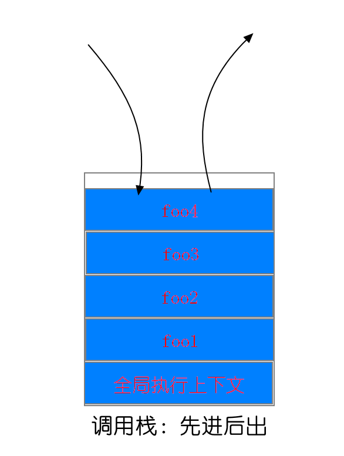
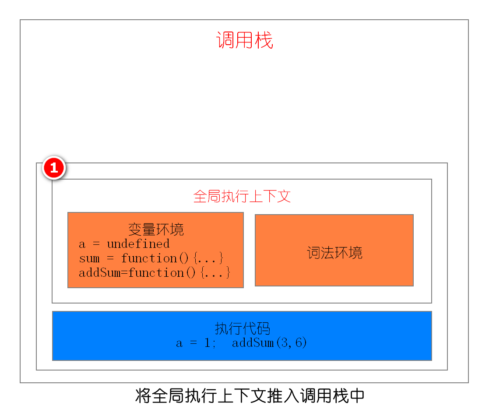
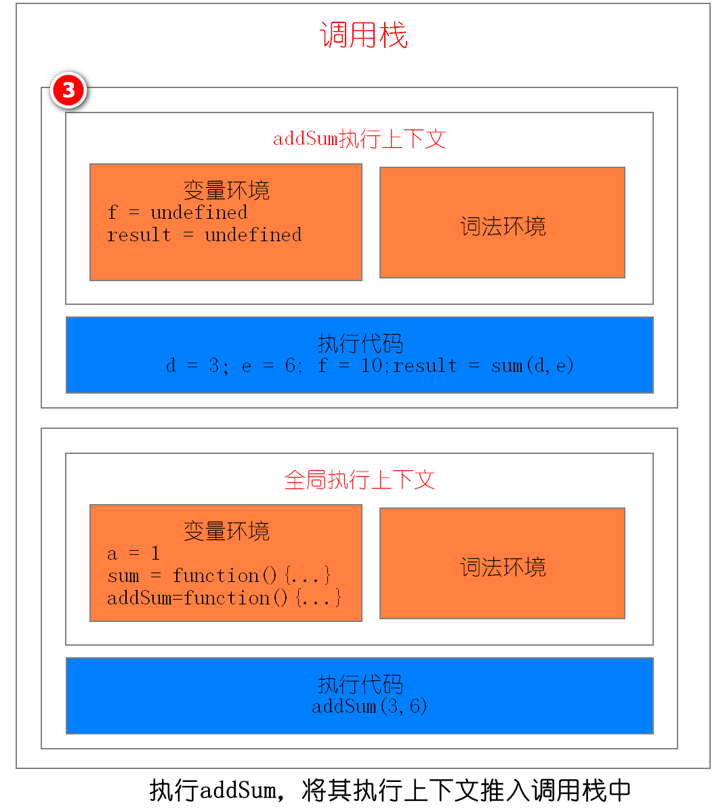
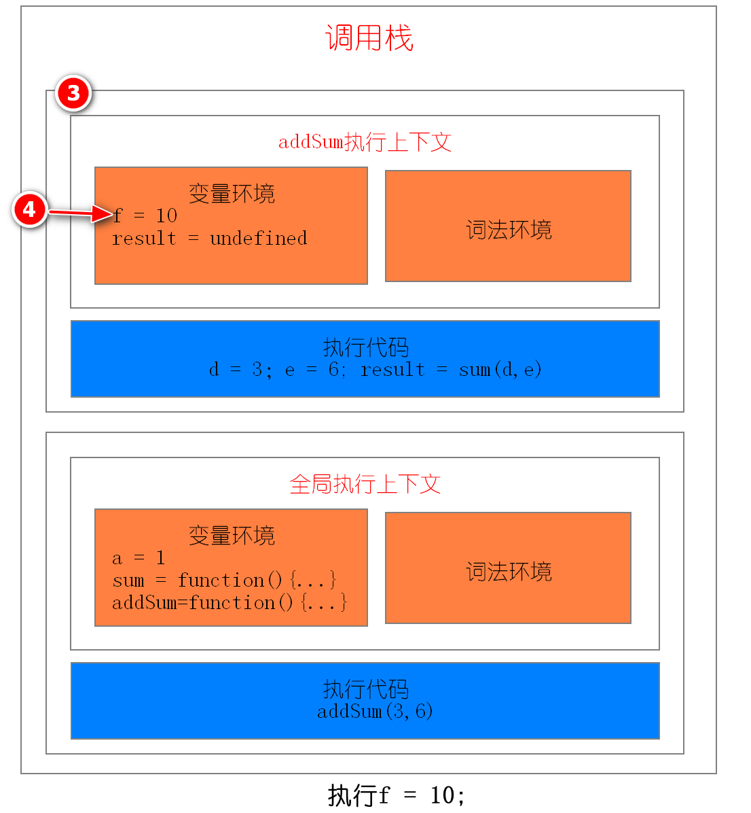
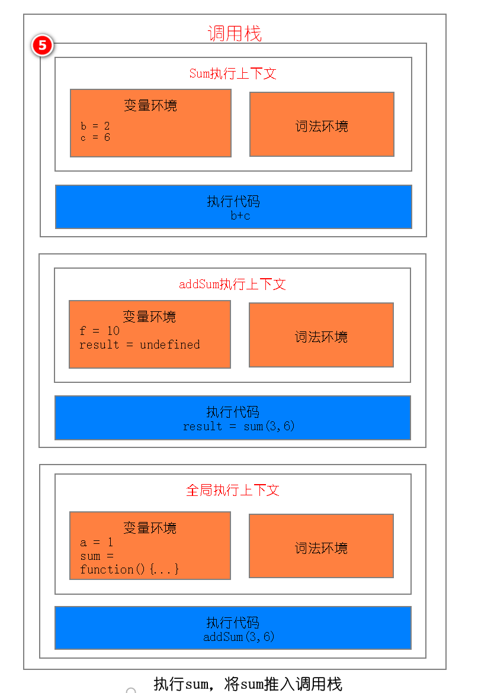
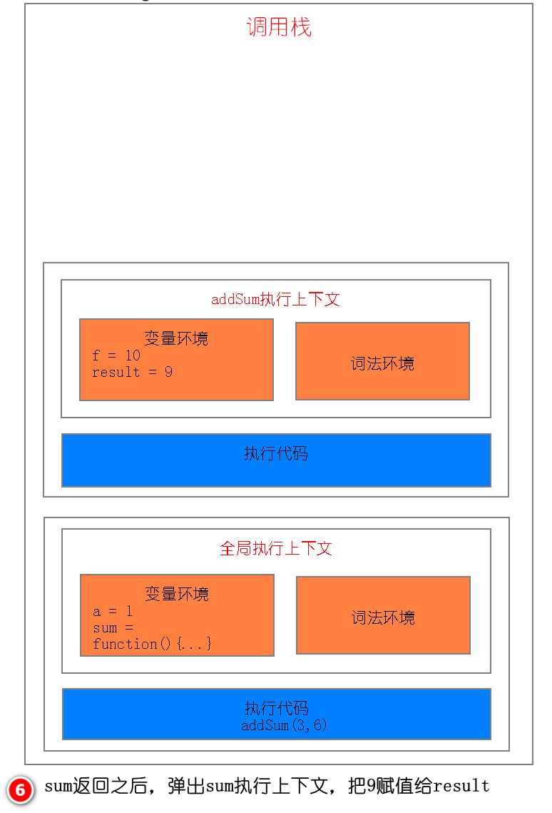
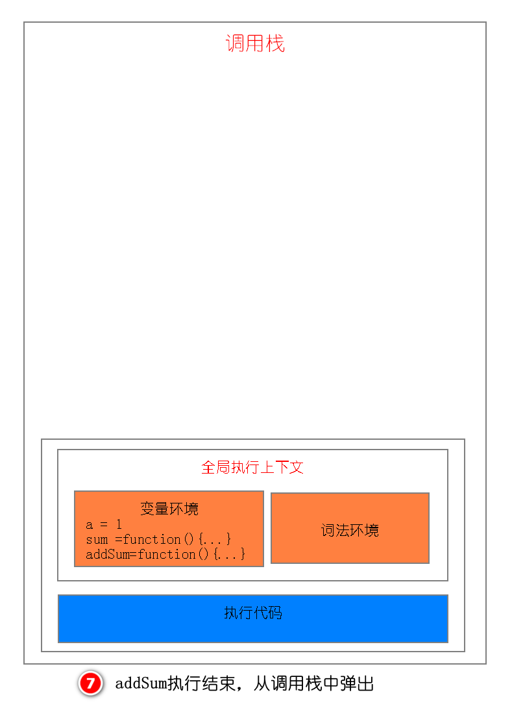

# 调用栈

## 1. 在执行之前就进行编译并创建执行上下文

1. 当 JavaScript 执行全局代码的时候，会编译全局代码并创建全局执行上下文，而且在整个页面的生存周期内，全局执行上下文只有一份。
2. 当调用一个函数的时候，函数体内的代码会被编译，并创建函数执行上下文，一般情况下，函数执行结束之后，创建的函数执行上下文会被销毁。
3. 当使用 eval 函数的时候，eval 的代码也会被编译，并创建执行上下文。

## 2. 调用栈

JavaScript 中有很多函数，经常会出现在一个函数中调用另外一个函数的情况，**调用栈就是用来管理函数调用关系的一种数据结构**。

调用栈特点：**后进先出**



JavaScript 引擎会将执行上下文压入栈中，通常把这种用来管理执行上下文的栈称为执行上下文栈，又称**调用栈**

```js
var a = 1;
function sum(b,c){ 
	return b+c
};
function addSum(d,e){
	var f = 10;
	result = add(d,e);
	return a+result+f
};
addSum(3,6)
```

第一步：创建全局上下文，并将其压入栈底，执行a = 1;




第二步：调用addSum函数，JavaScript 引擎会编译该函数，并为其创建一个执行上下文，最后还将该函数的执行上下文压入栈中





第三步：当执行到 add 函数调用语句时，同样会为其创建执行上下文，并将其压入调用栈



第四步：当 add 函数返回时，该函数的执行上下文就会从栈顶弹出，并将 result 的值设置为 add 函数的返回值，也就是 9



第五步：addSum 执行最后一个相加操作后并返回，addSum 的执行上下文也会从栈顶部弹出，此时调用栈中就只剩下全局上下文了

