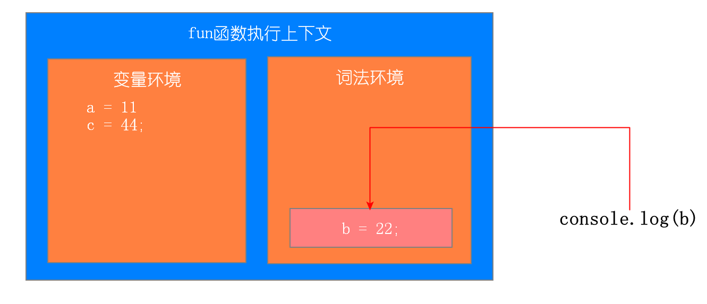

# 作用域链和闭包

## 1. 作用域

**作用域**是指在程序中定义变量的区域，该位置决定了变量的生命周期。通俗地理解，作用域就是变量与函数的可访问范围，即作用域控制着变量和函数的可见性和生命周期。

**在 ES6 之前，ES 的作用域只有两种：全局作用域和函数作用域。**

* **全局作用域**中的对象在代码中的任何地方都能访问，其生命周期伴随着页面的生命周期。

* **函数作用域**就是在函数内部定义的变量或者函数，并且定义的变量或者函数只能在函数内部被访问。函数执行结束之后，函数内部定义的变量会被销毁。

**ES6支持块级作用域**

* **块级作用域特点**：在代码块内部定义的变量在代码块外部是访问不到的，并且等该代码块中的代码执行完成之后，代码块中定义的变量会被销毁。

* **块级作用域形式：**就是使用一对大括号包裹的一段代码，比如函数、判断语句、循环语句，甚至单独的一个{}都可以被看作是一个块级作用域。

  ```javascript
  //if块
  if(1){}
  //while块
  while(1){}
  //函数块
  function foo(){} 
  //for循环块
  for(let i = 0; i<100; i++){}
  //单独一个块
  {}
  ```

* **ES6中如何使块级作用域生效**：使用let和const关键字

  ```javascript
  for(var i = 0; i<100; i++){
  }
  console.log(i)
  ```

  ```javascript
  for(let i = 0; i<100; i++){
  }
  console.log(i)
  ```

  引申考题：隔一秒钟打印出来一个自然数，自然数递增

  ```javascript
  for(let i = 0; i<10; i++){
  	setTimeout(function(){
  		console.log(i)
  	},1000*i)	
  }
  ```

  ```javascript
  for(var i = 0; i<10; i++){
  	setTimeout(function(){
  		console.log(i)
  	},1000*i)	
  }
  ```

**let、const关键字解决var关键字变量提升的问题**

* 由于变量提升，变量值容易被覆盖

  ```javascript
  var myname = "王美丽"
  function showName(){ 
  	console.log(myname); 
  	if(0){ 
  		var myname = "闷倒驴" }
  		console.log(myname);
  	}
  showName()
  ```

* 本该销毁的变量销毁不掉

  ```javascript
  for(var i = 0; i<100; i++){
  }
  console.log(i)
  ```
  
  

**let、const关键字解决问题的原理**

* let和const关键字创建的变量存储在词法环境中，var关键字创建的变量存储在变量环境中

* 块级内部代码执行结束，立马销毁内部let、const创建的变量

* let和const创建的变量，初始化不提升，创建提升，所以造成暂时性死区

* 访问变量先在当前执行上下文的词法环境中查找，再到变量环境中查找

  ```javascript
  function fun(){ 
  	var a = 11;
  	let b = 22;
  	{ 	
  		let b = 33;
  		var c = 44;
          let d = 55;
          console.log(a);
          console.log(b);
      }
  	console.log(b);
  	console.log(c);
  	console.log(d);
  } 
  fun()
  ```

  第一步：刚开始执行fun函数

  

  第二步：执行内部代码块

  

  

  第三步：执行代码块中console.log(a) console.log(b) 

  

  

第四步：代码块执行结束，相应词法环境中的变量弹出

​	

第五步：执行console.log(b);console.log(c);




第六步：执行console.log(d),找不到报错


**关于变量提升问题**

* var的创建和初始化被提升，赋值不会被提升。
* let的创建被提升，初始化和赋值不会被提升，所以会造成暂时性死区（就是访问不到）。
* function的创建、初始化和赋值均会被提升。

**作用域的特点：是代码编译阶段就决定好的，和函数是怎么调用的没有关系。**

```javascript
function bar() { 
	var myName = "王美丽";
    let test1 = 100;
    if (1) { 
    	let myName = "丑八怪"; 
    	console.log(test);
    }
}
function foo() { 
	var myName = "闷倒驴";
    let test = 2;
    { 
    	let test = 3;
        bar();
    }
};
var myName = "大喇叭";
let myAge = 10;
let test =1;
foo();
```


## 2. 作用域链

**作用域链**：当一个函数中使用了某个变量，首先会在自己内部作用域查找，然后再向外部一层一层查找，直到全局作用域，这个链式查找就是作用域链

```javascript
let num = 1;
        function fun1 (){
            function fun2(){
                function fun3(){
                    console.log(num);
                }
                fun3()
            }
            fun2()
        }
        fun1();
```


## 3.闭包

### 3.1 什么是闭包

```javascript
function foo() { 
	var myName = "王美丽";
	let test1 = 1;
	const test2 = 2; 
	var innerBar = { 
		getName:function(){ console.log(test1) return myName }, 
		setName:function(newName){ myName = newName } 
	} 
	return innerBar
}
var bar = foo();
bar.setName("闷倒驴");
bar.getName();
console.log(bar.getName())
```


### 3.2 闭包形成的原理

* 作用域链，当前作用域可以访问上级作用域中的变量
* 全局变量只用页面关闭才会销毁

### 3.3 闭包解决的问题

* 函数作用域中的变量在函数执行结束就会销毁，但是有时候我们并不希望变量销毁
* 在函数外部可以访问函数内部的变量

### 3.4 闭包带来的问题

* 容易造成内存泄露

  * 内存泄漏：占用的内存没有及时释放，内存泄露积累多了就容易导致内存溢出

    * 闭包

      ```javascript
      function fn1() {
          var a = 4
          function fn2() {
            console.log(++a)
          }
          return fn2
        }
        var f = fn1()
        f()
      ```


### 3.5 闭包的应用

* 模仿块级作用域

  ```javascript
  for(var i = 0; i < 5; i++) {
      (function(j){
          setTimeout(() => {
              console.log(j);
          }, j * 1000);
      })(i)
  }
  ```

  ```javascript
    for (var i = 0; i < lis.length; i++) {
              (function (j) {
                  lis[j].onclick = function () {
                      alert(j)
                  }
              })(i)
          }
  ```

  

* 埋点计数器

  ```javascript
  function count () {
  	var num = 0;
  	return function(){
  	 num++;
  	 return num;
  	}
  }
  var num = count();
  ```

* 柯里化

  ```javascript
   function curryingCheck(reg) {
              return function (txt) {
                  return reg.test(txt)
              }
          }
  
          var isPhone = curryingCheck(/^(13[0-9]|14[5|7]|15[0|1|2|3|4|5|6|7|8|9]|18[0|1|2|3|5|6|7|8|9])\d{8}$/)
          console.log(isPhone('15810606459'))    // true
  
          var isEmail = curryingCheck(/^\w+([-+.]\w+)*@\w+([-.]\w+)*\.\w+([-.]\w+)*$/)
          console.log(isEmail('wyn@nowcoder.com'))      // false
  ```

